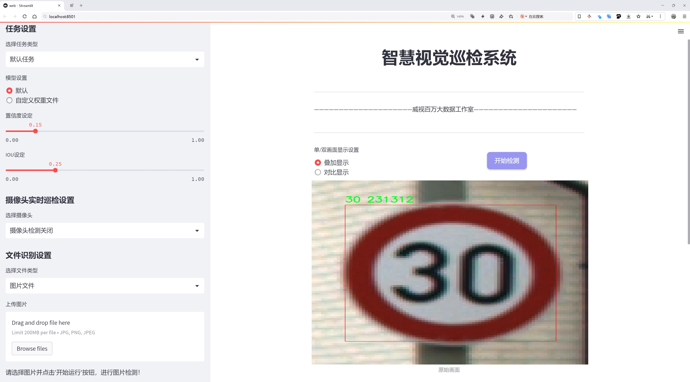
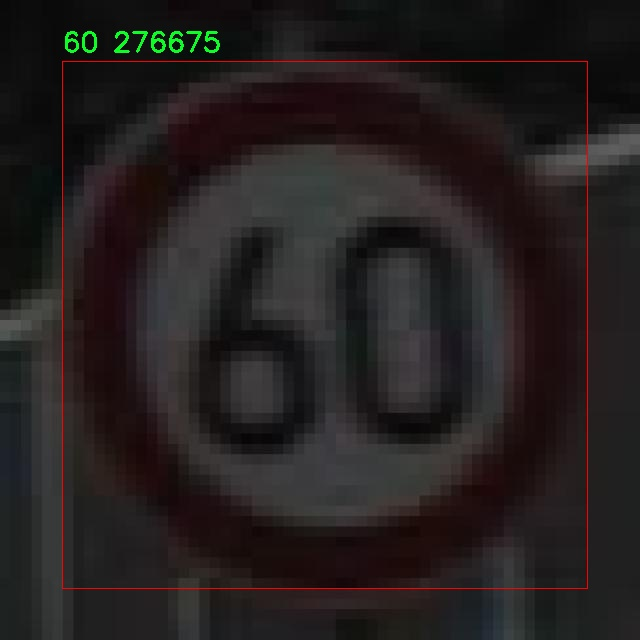

# 限速标志检测检测系统源码分享
 # [一条龙教学YOLOV8标注好的数据集一键训练_70+全套改进创新点发刊_Web前端展示]

### 1.研究背景与意义

项目参考[AAAI Association for the Advancement of Artificial Intelligence](https://gitee.com/qunshansj/projects)

项目来源[AACV Association for the Advancement of Computer Vision](https://gitee.com/qunmasj/projects)

研究背景与意义

随着城市化进程的加快，交通安全问题日益凸显，限速标志作为交通管理的重要组成部分，直接影响着道路交通的安全性和通畅性。限速标志的有效识别与检测，不仅有助于提高驾驶员的安全意识，还能为智能交通系统的构建提供基础数据支持。近年来，深度学习技术的迅猛发展为计算机视觉领域带来了新的机遇，尤其是在目标检测任务中，YOLO（You Only Look Once）系列模型因其高效性和准确性而受到广泛关注。YOLOv8作为该系列的最新版本，凭借其改进的网络结构和算法，展现出更强的实时检测能力和更高的检测精度。

本研究旨在基于改进的YOLOv8模型，构建一个高效的限速标志检测系统。该系统将利用“DataTrainYolov7”数据集，该数据集包含3000张图像，涵盖了10个类别的限速标志。这些类别不仅包括常见的限速标志，如16、17、18、20、21、22、23、24等数字标志，还涉及特定的交通标志（如“dog”和“nhathoducba”），为模型的训练提供了丰富的样本和多样化的场景。这种多样性有助于提高模型在不同环境下的适应能力，从而增强限速标志的检测准确性。

限速标志检测系统的研究意义在于，它不仅能够为交通管理部门提供实时的限速信息，还能为智能驾驶、自动驾驶等新兴技术的发展奠定基础。通过高效的限速标志检测，自动驾驶系统能够实时获取道路信息，从而做出更为安全的行驶决策。此外，该系统还可以与其他交通监控系统相结合，实现对交通流量的智能分析与管理，进而优化城市交通布局，提升交通效率。

在技术层面，改进YOLOv8模型的应用将推动目标检测技术的发展。YOLOv8在模型结构、特征提取、损失函数等方面的创新，能够有效提升检测速度和精度，尤其是在复杂背景下的目标检测能力。通过对YOLOv8的改进和优化，本研究将探索如何在保证实时性的前提下，进一步提高限速标志的检测精度，为后续的研究提供新的思路和方法。

综上所述，基于改进YOLOv8的限速标志检测系统的研究，不仅具有重要的理论价值，也具备广泛的应用前景。通过深入分析和探讨限速标志的检测技术，推动智能交通系统的发展，最终实现更安全、更高效的交通管理目标。

### 2.图片演示





##### 注意：由于此博客编辑较早，上面“2.图片演示”和“3.视频演示”展示的系统图片或者视频可能为老版本，新版本在老版本的基础上升级如下：（实际效果以升级的新版本为准）

  （1）适配了YOLOV8的“目标检测”模型和“实例分割”模型，通过加载相应的权重（.pt）文件即可自适应加载模型。

  （2）支持“图片识别”、“视频识别”、“摄像头实时识别”三种识别模式。

  （3）支持“图片识别”、“视频识别”、“摄像头实时识别”三种识别结果保存导出，解决手动导出（容易卡顿出现爆内存）存在的问题，识别完自动保存结果并导出到tempDir中。

  （4）支持Web前端系统中的标题、背景图等自定义修改，后面提供修改教程。

  另外本项目提供训练的数据集和训练教程,暂不提供权重文件（best.pt）,需要您按照教程进行训练后实现图片演示和Web前端界面演示的效果。

### 3.视频演示

[3.1 视频演示](https://www.bilibili.com/video/BV1K7tFezExy/)

### 4.数据集信息展示

##### 4.1 本项目数据集详细数据（类别数＆类别名）

nc: 10
names: ['100', '120', '20', '30', '40', '50', '60', '70', '80', '90']


##### 4.2 本项目数据集信息介绍

数据集信息展示

在本研究中，我们使用了名为“DataTrainYolov7”的数据集，以训练和改进YOLOv8模型在限速标志检测系统中的表现。该数据集专门设计用于交通标志识别，尤其是限速标志的检测与分类，旨在提高自动驾驶系统和交通监控系统的准确性与可靠性。数据集的构建充分考虑了现实交通环境中的多样性和复杂性，以确保模型在实际应用中的有效性。

“DataTrainYolov7”数据集包含10个类别的限速标志，这些类别分别是：100、120、20、30、40、50、60、70、80和90。这些类别涵盖了大多数国家和地区常见的限速标志，能够满足不同交通法规的需求。每个类别的标志代表了特定的速度限制，适用于城市道路、高速公路及其他类型的交通环境。数据集的多样性不仅体现在标志的种类上，还包括标志的形状、颜色、背景以及光照条件等多方面的变化，这些因素都可能影响模型的检测性能。

为了确保数据集的质量和有效性，数据集中的每一张图像都经过精心挑选和标注。标注过程中，使用了高精度的标注工具，确保每个限速标志的边界框准确无误。每个标志的类别信息也被详细记录，以便于后续的训练和评估。数据集中的图像来源广泛，包括城市街道、高速公路、乡村道路等多种场景，确保模型能够在不同的环境中进行有效的限速标志检测。

在数据集的构建过程中，特别关注了数据的平衡性。每个类别的样本数量经过精心设计，以避免模型在训练过程中出现偏倚现象。通过对每个类别进行均衡采样，确保模型在学习过程中能够充分接触到每种限速标志，从而提高其在实际应用中的泛化能力。此外，数据集中还包含了一些特殊情况的样本，例如被遮挡的标志、不同天气条件下的拍摄图像等，以增强模型的鲁棒性。

在训练过程中，我们将“DataTrainYolov7”数据集与YOLOv8模型相结合，利用其先进的特征提取和检测能力，旨在提升限速标志的检测精度和速度。通过对数据集的不断迭代和优化，我们期望最终构建出一个高效、准确的限速标志检测系统，能够在各种复杂的交通环境中稳定运行。

总之，“DataTrainYolov7”数据集为限速标志检测系统的训练提供了坚实的基础。通过对数据集的深入分析和合理利用，我们希望能够推动自动驾驶技术的发展，提高交通安全性，为智能交通系统的实现贡献一份力量。





### 5.全套项目环境部署视频教程（零基础手把手教学）

[5.1 环境部署教程链接（零基础手把手教学）](https://www.ixigua.com/7404473917358506534?logTag=c807d0cbc21c0ef59de5)


[5.2 安装Python虚拟环境创建和依赖库安装视频教程链接（零基础手把手教学）](https://www.ixigua.com/7404474678003106304?logTag=1f1041108cd1f708b01a)

### 6.手把手YOLOV8训练视频教程（零基础小白有手就能学会）

[6.1 手把手YOLOV8训练视频教程（零基础小白有手就能学会）](https://www.ixigua.com/7404477157818401292?logTag=d31a2dfd1983c9668658)

### 7.70+种全套YOLOV8创新点代码加载调参视频教程（一键加载写好的改进模型的配置文件）

[7.1 70+种全套YOLOV8创新点代码加载调参视频教程（一键加载写好的改进模型的配置文件）](https://www.ixigua.com/7404478314661806627?logTag=29066f8288e3f4eea3a4)

### 8.70+种全套YOLOV8创新点原理讲解（非科班也可以轻松写刊发刊，V10版本正在科研待更新）

由于篇幅限制，每个创新点的具体原理讲解就不一一展开，具体见下列网址中的创新点对应子项目的技术原理博客网址【Blog】：


[8.1 70+种全套YOLOV8创新点原理讲解链接](https://gitee.com/qunmasj/good)

### 9.系统功能展示（检测对象为举例，实际内容以本项目数据集为准）

图9.1.系统支持检测结果表格显示

  图9.2.系统支持置信度和IOU阈值手动调节

  图9.3.系统支持自定义加载权重文件best.pt(需要你通过步骤5中训练获得)

  图9.4.系统支持摄像头实时识别

  图9.5.系统支持图片识别

  图9.6.系统支持视频识别

  图9.7.系统支持识别结果文件自动保存

  图9.8.系统支持Excel导出检测结果数据


### 10.原始YOLOV8算法原理

原始YOLOv8算法原理

YOLOv8是YOLO系列目标检测算法的最新进展，代表了计算机视觉领域在实时目标检测技术上的重要突破。相较于前一代的YOLOv5，YOLOv8在检测精度和速度上都实现了显著的提升，展现出更为强大的性能。其设计理念源于将目标检测任务转化为回归问题，通过一个统一的神经网络模型同时预测目标的位置和类别，进而实现高效的目标检测。

YOLOv8的网络结构可分为四个主要部分：输入端、骨干网络、颈部网络和头部网络。输入端采用了马赛克数据增强技术，这种方法通过将多张图像拼接在一起，生成多样化的训练样本，从而增强模型的泛化能力。此外，YOLOv8还引入了自适应锚框计算和自适应灰度填充，进一步提高了模型对不同场景的适应性。

在骨干网络部分，YOLOv8使用了C2f结构，这一模块是对残差特征进行学习的核心部分。C2f模块的设计灵感来源于YOLOv7的ELAN结构，通过增加分支和跨层连接，增强了模型的梯度流动性，从而提高了特征表示能力。与YOLOv5的C3结构相比，C2f结构的梯度流更加丰富，使得YOLOv8在特征提取上表现得更加出色。此外，YOLOv8还引入了空间金字塔池化融合（SPPF）结构，以进一步增强对多尺度特征的处理能力。

颈部网络采用了路径聚合网络（PAN）结构，旨在加强网络对不同缩放尺度对象的特征融合能力。PAN通过将不同层次的特征进行有效的聚合，使得模型能够更好地理解和处理不同尺寸的目标。这一设计使得YOLOv8在复杂场景下的表现更加稳健，能够有效应对各种目标检测任务。

头部网络是YOLOv8的另一个重要创新点。YOLOv8将分类和检测过程进行了解耦，采用了主流的解耦头结构，取代了以往的耦合头。这一改进使得分类和回归任务可以独立优化，从而提高了模型在复杂场景下的定位精度和分类准确性。同时，YOLOv8引入了无锚框检测头（Anchor-Free），这一方法避免了传统目标检测中锚框选择和调整的繁琐过程。通过直接预测目标的位置和大小，YOLOv8能够更快地聚焦于目标位置的邻近点，使得预测框更接近实际边界框区域。

在损失计算方面，YOLOv8采用了Task-Aligned Assigner分配策略，依据分类与回归的分数加权结果选择正样本。这一策略的引入使得模型在训练过程中能够更有效地分配正负样本，从而提升了训练效果。损失计算涵盖了分类和回归两个分支，其中分类分支使用了二元交叉熵损失（BCELoss），而回归分支则结合了分布焦点损失（DFLoss）和完全交并比损失函数（CIOULoss），进一步提高了模型对边界框预测的精准性。

YOLOv8的设计不仅在网络结构上进行了优化，还在模型的轻量化方面取得了显著进展。通过对不同尺度模型调整不同的通道数，YOLOv8实现了进一步的轻量化，使得模型能够在嵌入式设备上高效运行。这一特性使得YOLOv8在实时检测任务中具备了更强的适应性，能够满足各种应用场景的需求。

总的来说，YOLOv8作为YOLO系列的最新作品，融合了前几代算法的优点，结合了新的设计理念和技术，达到了实时检测领域的新高度。其高精度和快速响应的特点，使得YOLOv8在目标检测领域具有广泛的应用潜力。无论是在工业自动化、智能监控，还是在农业采摘等实际应用中，YOLOv8都展现出了强大的视觉识别能力，为各类任务的自动化提供了有力支持。随着YOLOv8的不断发展和完善，未来的目标检测技术将会更加智能和高效，为人类的生产和生活带来更多便利。


### 11.项目核心源码讲解（再也不用担心看不懂代码逻辑）

#### 11.1 ui.py

以下是经过精简和注释的核心代码：

```python
import sys
import subprocess

def run_script(script_path):
    """
    使用当前 Python 环境运行指定的脚本。

    Args:
        script_path (str): 要运行的脚本路径
    """
    # 获取当前 Python 解释器的路径
    python_path = sys.executable

    # 构建运行命令，使用 streamlit 运行指定的脚本
    command = f'"{python_path}" -m streamlit run "{script_path}"'

    # 执行命令并捕获结果
    result = subprocess.run(command, shell=True)
    
    # 检查命令执行结果，如果返回码不为0，则表示出错
    if result.returncode != 0:
        print("脚本运行出错。")

# 主程序入口
if __name__ == "__main__":
    # 指定要运行的脚本路径
    script_path = "web.py"  # 假设脚本在当前目录下

    # 调用函数运行脚本
    run_script(script_path)
```

### 代码注释说明：
1. **导入模块**：
   - `sys`：用于获取当前 Python 解释器的路径。
   - `subprocess`：用于执行外部命令。

2. **run_script 函数**：
   - 定义了一个函数 `run_script`，接收一个参数 `script_path`，表示要运行的脚本路径。
   - 使用 `sys.executable` 获取当前 Python 解释器的路径。
   - 构建一个命令字符串，使用 `streamlit` 模块运行指定的脚本。
   - 使用 `subprocess.run` 执行命令，并捕获执行结果。
   - 检查命令的返回码，如果不为0，表示脚本运行出错，打印错误信息。

3. **主程序入口**：
   - 通过 `if __name__ == "__main__":` 确保只有在直接运行该脚本时才会执行以下代码。
   - 指定要运行的脚本路径（这里假设为 `web.py`）。
   - 调用 `run_script` 函数，传入脚本路径以执行。

这个程序文件 `ui.py` 是一个用于运行 Python 脚本的简单工具，特别是用于启动一个 Streamlit 应用。程序的核心功能是通过当前的 Python 环境来执行指定的脚本。

首先，文件导入了几个必要的模块，包括 `sys`、`os` 和 `subprocess`。其中，`sys` 模块用于访问与 Python 解释器相关的变量和函数，`os` 模块提供了与操作系统交互的功能，而 `subprocess` 模块则允许程序启动新进程、连接到它们的输入/输出/错误管道，并获取它们的返回码。

接下来，程序定义了一个名为 `run_script` 的函数，该函数接受一个参数 `script_path`，表示要运行的脚本的路径。在函数内部，首先获取当前 Python 解释器的路径，这通过 `sys.executable` 实现。然后，构建一个命令字符串，使用 `streamlit run` 命令来运行指定的脚本。这个命令会在当前的 Python 环境中执行。

随后，使用 `subprocess.run` 方法来执行构建好的命令。这个方法会在一个新的子进程中运行命令，并等待其完成。如果脚本运行的返回码不为零，表示执行过程中出现了错误，程序会打印出一条错误信息。

在文件的最后部分，使用 `if __name__ == "__main__":` 语句来确保当这个文件作为主程序运行时，以下代码才会被执行。这里指定了要运行的脚本路径为 `web.py`，并调用 `run_script` 函数来执行这个脚本。

总的来说，这个 `ui.py` 文件的功能是通过命令行调用 Streamlit 来运行一个名为 `web.py` 的 Python 脚本，提供了一种简便的方式来启动 Streamlit 应用。

#### 11.2 code\ultralytics\data\__init__.py

以下是保留的核心部分代码，并附上详细的中文注释：

```python
# 导入基础数据集类
from .base import BaseDataset
# 导入构建数据加载器和YOLO数据集的函数
from .build import build_dataloader, build_yolo_dataset, load_inference_source
# 导入分类数据集、语义数据集和YOLO数据集的实现
from .dataset import ClassificationDataset, SemanticDataset, YOLODataset

# 定义模块的公开接口，包含可以被外部访问的类和函数
__all__ = (
    "BaseDataset",          # 基础数据集类
    "ClassificationDataset", # 分类数据集类
    "SemanticDataset",      # 语义数据集类
    "YOLODataset",          # YOLO数据集类
    "build_yolo_dataset",   # 构建YOLO数据集的函数
    "build_dataloader",     # 构建数据加载器的函数
    "load_inference_source", # 加载推理源的函数
)
```

### 注释说明：
1. **导入模块**：代码首先导入了需要的类和函数，这些类和函数是构建和处理数据集的基础。
2. **公开接口**：`__all__` 列表定义了该模块的公共接口，只有在这个列表中的类和函数可以被外部访问。这有助于控制模块的可用性，避免外部访问内部实现细节。

这个程序文件是Ultralytics YOLO项目中的一个初始化文件，文件名为`__init__.py`，其主要作用是定义模块的公共接口。首先，文件顶部的注释部分表明这是Ultralytics YOLO项目的一部分，并且遵循AGPL-3.0许可证。

接下来，文件通过相对导入的方式引入了几个模块和类。具体来说，它从`base`模块中导入了`BaseDataset`类，从`build`模块中导入了三个函数：`build_dataloader`、`build_yolo_dataset`和`load_inference_source`，以及从`dataset`模块中导入了三个数据集类：`ClassificationDataset`、`SemanticDataset`和`YOLODataset`。

最后，`__all__`变量被定义为一个元组，列出了该模块公开的所有类和函数。这意味着当使用`from module import *`的方式导入时，只会导入这些指定的内容。这种做法有助于控制模块的接口，确保用户只接触到模块的公共部分，而隐藏内部实现细节。

总体而言，这个文件的主要功能是组织和暴露与数据集相关的类和构建函数，为YOLO模型的训练和推理提供必要的支持。

#### 11.3 code\ultralytics\utils\callbacks\__init__.py

```python
# 导入必要的函数和模块
# Ultralytics YOLO 🚀, AGPL-3.0 license

# 从当前包的 base 模块中导入三个函数
from .base import add_integration_callbacks, default_callbacks, get_default_callbacks

# 定义模块的公开接口，指定可以被外部访问的函数
__all__ = "add_integration_callbacks", "default_callbacks", "get_default_callbacks"
```

### 代码注释说明：
1. **导入模块**：
   - `from .base import add_integration_callbacks, default_callbacks, get_default_callbacks`：从当前包的 `base` 模块中导入三个函数。这些函数可能用于处理回调、默认回调设置等功能。

2. **公开接口**：
   - `__all__`：这是一个特殊变量，用于定义模块的公共接口。当使用 `from module import *` 语句时，只有在 `__all__` 中列出的名称会被导入。这有助于控制模块的可见性，避免不必要的名称冲突。

这个程序文件是一个Python模块，位于`code/ultralytics/utils/callbacks/`目录下，文件名为`__init__.py`。该文件的主要功能是初始化包，并定义了模块的公共接口。

首先，文件开头的注释部分提到这是与Ultralytics YOLO相关的代码，并指出该代码遵循AGPL-3.0许可证。这意味着该代码是开源的，用户可以自由使用和修改，但在分发修改后的版本时需要遵循相同的许可证条款。

接下来，文件通过`from .base import ...`语句从同一目录下的`base`模块中导入了三个函数：`add_integration_callbacks`、`default_callbacks`和`get_default_callbacks`。这些函数可能与回调机制有关，回调通常用于在特定事件发生时执行某些操作，这在机器学习和深度学习框架中是非常常见的。

最后，`__all__`变量被定义为一个元组，包含了上述导入的三个函数名。这一行的作用是明确指定当使用`from module import *`语句时，哪些名称会被导入。这是一个良好的编程习惯，可以帮助控制模块的公共接口，避免不必要的名称冲突。

总体来说，这个文件的主要作用是作为一个包的初始化文件，导入必要的功能，并定义模块的公共接口，以便其他模块可以方便地使用这些功能。

#### 11.4 code\ultralytics\__init__.py

以下是代码中最核心的部分，并附上详细的中文注释：

```python
# 导入必要的库和模块
from ultralytics.models import YOLO  # 导入YOLO模型
from ultralytics.utils import SETTINGS as settings  # 导入设置配置
from ultralytics.utils.checks import check_yolo as checks  # 导入YOLO检查工具
from ultralytics.utils.downloads import download  # 导入下载工具

# 定义模块的版本
__version__ = "8.1.3"

# 定义模块的公开接口，方便其他模块导入
__all__ = "__version__", "YOLO", "checks", "download", "settings"
```

### 详细注释说明：
1. **导入模块**：
   - `from ultralytics.models import YOLO`：导入YOLO模型，这是一个用于目标检测的深度学习模型。
   - `from ultralytics.utils import SETTINGS as settings`：导入设置配置，通常包含模型的超参数和其他配置选项。
   - `from ultralytics.utils.checks import check_yolo as checks`：导入YOLO相关的检查工具，用于验证模型的有效性和正确性。
   - `from ultralytics.utils.downloads import download`：导入下载工具，通常用于下载预训练模型或数据集。

2. **版本定义**：
   - `__version__ = "8.1.3"`：定义当前模块的版本号，便于版本管理和追踪。

3. **公开接口**：
   - `__all__ = "__version__", "YOLO", "checks", "download", "settings"`：定义模块的公开接口，确保在使用`from module import *`时，只导入这些指定的对象。这有助于控制模块的命名空间，避免不必要的名称冲突。

这个程序文件是Ultralytics YOLO库的初始化文件，文件名为`__init__.py`，用于定义该库的版本以及导入相关模块和类。

首先，文件开头有一个注释，表明这是Ultralytics YOLO项目，并指明其使用的许可证类型为AGPL-3.0。接着，定义了一个版本号`__version__`，其值为"8.1.3"，这表明当前库的版本信息。

随后，文件导入了多个模块和类。具体来说，它从`ultralytics.data.explorer.explorer`模块中导入了`Explorer`类，这可能是用于数据探索和可视化的工具。此外，还导入了几个模型类，包括`RTDETR`、`SAM`、`YOLO`，以及从`ultralytics.models.fastsam`模块中导入的`FastSAM`类和从`ultralytics.models.nas`模块中导入的`NAS`类。这些模型类可能用于不同的计算机视觉任务，如目标检测和分割。

文件还导入了一些实用工具，包括`SETTINGS`，它可能包含一些配置设置；`check_yolo`，这个函数可能用于检查YOLO模型的有效性；以及`download`函数，用于下载相关资源或模型。

最后，使用`__all__`定义了一个公共接口，列出了该模块公开的名称，包括版本号、模型类、检查函数、下载函数、设置和数据探索器。这意味着在使用`from ultralytics import *`时，只有这些名称会被导入，从而控制了模块的可见性和使用方式。

总体来说，这个文件是Ultralytics YOLO库的核心部分，负责版本管理和模块的组织，使得用户可以方便地访问库中的功能。

#### 11.5 train.py

以下是代码中最核心的部分，并附上详细的中文注释：

```python
class DetectionTrainer(BaseTrainer):
    """
    DetectionTrainer类，继承自BaseTrainer类，用于基于检测模型的训练。
    """

    def build_dataset(self, img_path, mode="train", batch=None):
        """
        构建YOLO数据集。

        参数:
            img_path (str): 包含图像的文件夹路径。
            mode (str): 模式，`train`表示训练模式，`val`表示验证模式，用户可以为每种模式自定义不同的增强。
            batch (int, optional): 批次大小，仅在`rect`模式下使用。默认为None。
        """
        gs = max(int(de_parallel(self.model).stride.max() if self.model else 0), 32)  # 获取模型的最大步幅
        return build_yolo_dataset(self.args, img_path, batch, self.data, mode=mode, rect=mode == "val", stride=gs)

    def get_dataloader(self, dataset_path, batch_size=16, rank=0, mode="train"):
        """构造并返回数据加载器。"""
        assert mode in ["train", "val"]  # 确保模式是训练或验证
        with torch_distributed_zero_first(rank):  # 在分布式训练中，确保数据集只初始化一次
            dataset = self.build_dataset(dataset_path, mode, batch_size)  # 构建数据集
        shuffle = mode == "train"  # 训练模式下打乱数据
        if getattr(dataset, "rect", False) and shuffle:
            LOGGER.warning("WARNING ⚠️ 'rect=True'与DataLoader的shuffle不兼容，设置shuffle=False")
            shuffle = False  # 如果使用rect模式，则不打乱数据
        workers = self.args.workers if mode == "train" else self.args.workers * 2  # 根据模式设置工作线程数
        return build_dataloader(dataset, batch_size, workers, shuffle, rank)  # 返回数据加载器

    def preprocess_batch(self, batch):
        """对一批图像进行预处理，包括缩放和转换为浮点数。"""
        batch["img"] = batch["img"].to(self.device, non_blocking=True).float() / 255  # 将图像转移到设备并归一化
        if self.args.multi_scale:  # 如果启用多尺度
            imgs = batch["img"]
            sz = (
                random.randrange(self.args.imgsz * 0.5, self.args.imgsz * 1.5 + self.stride)
                // self.stride
                * self.stride
            )  # 随机选择新的图像大小
            sf = sz / max(imgs.shape[2:])  # 计算缩放因子
            if sf != 1:  # 如果缩放因子不为1
                ns = [
                    math.ceil(x * sf / self.stride) * self.stride for x in imgs.shape[2:]
                ]  # 计算新的形状
                imgs = nn.functional.interpolate(imgs, size=ns, mode="bilinear", align_corners=False)  # 进行插值
            batch["img"] = imgs  # 更新批次中的图像
        return batch

    def get_model(self, cfg=None, weights=None, verbose=True):
        """返回YOLO检测模型。"""
        model = DetectionModel(cfg, nc=self.data["nc"], verbose=verbose and RANK == -1)  # 创建检测模型
        if weights:
            model.load(weights)  # 加载权重
        return model

    def get_validator(self):
        """返回YOLO模型验证器。"""
        self.loss_names = "box_loss", "cls_loss", "dfl_loss"  # 定义损失名称
        return yolo.detect.DetectionValidator(
            self.test_loader, save_dir=self.save_dir, args=copy(self.args), _callbacks=self.callbacks
        )  # 返回验证器

    def plot_training_samples(self, batch, ni):
        """绘制带有注释的训练样本。"""
        plot_images(
            images=batch["img"],
            batch_idx=batch["batch_idx"],
            cls=batch["cls"].squeeze(-1),
            bboxes=batch["bboxes"],
            paths=batch["im_file"],
            fname=self.save_dir / f"train_batch{ni}.jpg",
            on_plot=self.on_plot,
        )  # 绘制图像

    def plot_metrics(self):
        """从CSV文件中绘制指标。"""
        plot_results(file=self.csv, on_plot=self.on_plot)  # 保存结果图像
```

### 代码核心部分说明：
1. **DetectionTrainer类**：用于训练YOLO检测模型的主要类，继承自基础训练类`BaseTrainer`。
2. **build_dataset方法**：根据输入的图像路径和模式构建YOLO数据集，支持训练和验证模式。
3. **get_dataloader方法**：构建数据加载器，支持分布式训练，并根据模式选择是否打乱数据。
4. **preprocess_batch方法**：对输入的图像批次进行预处理，包括归一化和多尺度调整。
5. **get_model方法**：返回一个YOLO检测模型，并可选择加载预训练权重。
6. **get_validator方法**：返回用于验证模型性能的验证器。
7. **plot_training_samples和plot_metrics方法**：用于可视化训练样本和训练过程中的指标。

这个程序文件 `train.py` 是一个用于训练 YOLO（You Only Look Once）目标检测模型的脚本，继承自 `BaseTrainer` 类。该文件包含多个方法，主要用于构建数据集、加载数据、预处理图像、设置模型属性、获取模型、验证模型、记录损失、显示训练进度以及绘制训练样本和指标。

首先，`DetectionTrainer` 类定义了一个用于目标检测的训练器。用户可以通过传入模型配置、数据集路径和训练周期等参数来实例化该类，并调用 `train()` 方法开始训练。

在 `build_dataset` 方法中，程序根据传入的图像路径和模式（训练或验证）构建 YOLO 数据集。它会根据模型的步幅计算图像的缩放因子，并调用 `build_yolo_dataset` 函数来生成数据集。

`get_dataloader` 方法则负责构建数据加载器，确保在分布式训练时只初始化一次数据集，并根据模式设置是否打乱数据。它还会根据训练或验证模式调整工作线程的数量。

`preprocess_batch` 方法用于对图像批次进行预处理，包括将图像缩放到合适的大小并转换为浮点数格式。它支持多尺度训练，通过随机选择图像大小来增强模型的鲁棒性。

`set_model_attributes` 方法用于设置模型的属性，包括类别数量和类别名称。这些信息将被附加到模型中，以便在训练过程中使用。

`get_model` 方法返回一个 YOLO 检测模型的实例，并可选择加载预训练权重。

`get_validator` 方法返回一个用于验证模型性能的 `DetectionValidator` 实例，包含损失名称以便后续记录和分析。

`label_loss_items` 方法用于返回带有标签的训练损失字典，方便记录和分析训练过程中的损失情况。

`progress_string` 方法返回一个格式化的字符串，显示训练进度，包括当前周期、GPU 内存使用情况、损失值、实例数量和图像大小等信息。

`plot_training_samples` 方法用于绘制训练样本及其标注，帮助可视化训练过程中的数据。

最后，`plot_metrics` 和 `plot_training_labels` 方法分别用于绘制训练过程中的指标和创建带标签的训练图，帮助用户更好地理解模型的训练效果和性能。

总体而言，这个文件实现了 YOLO 模型训练的核心功能，涵盖了数据处理、模型构建、训练过程监控和结果可视化等多个方面。

#### 11.6 code\ultralytics\models\rtdetr\val.py

以下是代码中最核心的部分，并附上详细的中文注释：

```python
import torch
from ultralytics.data import YOLODataset
from ultralytics.models.yolo.detect import DetectionValidator
from ultralytics.utils import ops

class RTDETRDataset(YOLODataset):
    """
    实时检测与跟踪（RT-DETR）数据集类，继承自YOLODataset类。
    该数据集类专为RT-DETR目标检测模型设计，优化了实时检测和跟踪任务。
    """

    def __init__(self, *args, data=None, **kwargs):
        """初始化RTDETRDataset类，继承YOLODataset类的初始化方法。"""
        super().__init__(*args, data=data, **kwargs)

    def build_transforms(self, hyp=None):
        """构建数据转换操作，仅用于评估阶段。"""
        if self.augment:
            # 根据是否进行增强设置mosaic和mixup的值
            hyp.mosaic = hyp.mosaic if self.augment and not self.rect else 0.0
            hyp.mixup = hyp.mixup if self.augment and not self.rect else 0.0
            # 使用v8_transforms构建转换操作
            transforms = v8_transforms(self, self.imgsz, hyp, stretch=True)
        else:
            transforms = Compose([])  # 如果不进行增强，则不添加任何转换操作

        # 添加格式化操作，设置边界框格式、归一化等
        transforms.append(
            Format(
                bbox_format="xywh",  # 边界框格式为xywh
                normalize=True,  # 进行归一化
                return_mask=self.use_segments,  # 是否返回分割掩码
                return_keypoint=self.use_keypoints,  # 是否返回关键点
                batch_idx=True,  # 返回批次索引
                mask_ratio=hyp.mask_ratio,  # 掩码比例
                mask_overlap=hyp.overlap_mask,  # 掩码重叠
            )
        )
        return transforms


class RTDETRValidator(DetectionValidator):
    """
    RTDETRValidator类扩展了DetectionValidator类，提供专门针对RT-DETR模型的验证功能。
    该类允许构建RTDETR特定的数据集进行验证，应用非极大值抑制进行后处理，并相应更新评估指标。
    """

    def build_dataset(self, img_path, mode="val", batch=None):
        """
        构建RTDETR数据集。

        参数:
            img_path (str): 包含图像的文件夹路径。
            mode (str): 模式（`train`或`val`），用户可以为每种模式自定义不同的增强操作。
            batch (int, optional): 批次大小，仅用于`rect`模式。默认为None。
        """
        return RTDETRDataset(
            img_path=img_path,
            imgsz=self.args.imgsz,
            batch_size=batch,
            augment=False,  # 不进行增强
            hyp=self.args,
            rect=False,  # 不使用矩形模式
            cache=self.args.cache or None,
            prefix=colorstr(f"{mode}: "),
            data=self.data,
        )

    def postprocess(self, preds):
        """对预测输出应用非极大值抑制。"""
        bs, _, nd = preds[0].shape  # 获取批次大小、通道数和预测框数量
        bboxes, scores = preds[0].split((4, nd - 4), dim=-1)  # 分离边界框和分数
        bboxes *= self.args.imgsz  # 将边界框缩放到原始图像大小
        outputs = [torch.zeros((0, 6), device=bboxes.device)] * bs  # 初始化输出

        for i, bbox in enumerate(bboxes):  # 遍历每个边界框
            bbox = ops.xywh2xyxy(bbox)  # 将xywh格式转换为xyxy格式
            score, cls = scores[i].max(-1)  # 获取最大分数和对应的类别
            pred = torch.cat([bbox, score[..., None], cls[..., None]], dim=-1)  # 合并边界框、分数和类别
            pred = pred[score.argsort(descending=True)]  # 按照分数排序
            outputs[i] = pred  # 保存结果

        return outputs

    def _prepare_batch(self, si, batch):
        """准备训练或推理的批次，应用转换操作。"""
        idx = batch["batch_idx"] == si  # 获取当前批次的索引
        cls = batch["cls"][idx].squeeze(-1)  # 获取类别
        bbox = batch["bboxes"][idx]  # 获取边界框
        ori_shape = batch["ori_shape"][si]  # 获取原始图像形状
        imgsz = batch["img"].shape[2:]  # 获取图像大小
        ratio_pad = batch["ratio_pad"][si]  # 获取填充比例

        if len(cls):
            bbox = ops.xywh2xyxy(bbox)  # 转换边界框格式
            bbox[..., [0, 2]] *= ori_shape[1]  # 还原到原始空间
            bbox[..., [1, 3]] *= ori_shape[0]  # 还原到原始空间

        return dict(cls=cls, bbox=bbox, ori_shape=ori_shape, imgsz=imgsz, ratio_pad=ratio_pad)

    def _prepare_pred(self, pred, pbatch):
        """准备并返回转换后的边界框和类别标签的批次。"""
        predn = pred.clone()  # 克隆预测结果
        predn[..., [0, 2]] *= pbatch["ori_shape"][1] / self.args.imgsz  # 还原到原始空间
        predn[..., [1, 3]] *= pbatch["ori_shape"][0] / self.args.imgsz  # 还原到原始空间
        return predn.float()  # 返回浮点型的预测结果
```

### 代码核心部分说明：
1. **RTDETRDataset类**：用于创建RT-DETR特定的数据集，继承自YOLODataset，包含数据加载和转换的逻辑。
2. **build_transforms方法**：根据增强设置构建数据转换操作，支持不同的图像预处理。
3. **RTDETRValidator类**：扩展了DetectionValidator，提供RT-DETR模型的验证功能，包括数据集构建和后处理。
4. **postprocess方法**：实现非极大值抑制，处理模型预测的边界框和分数，确保输出的边界框是最优的。
5. **_prepare_batch和_prepare_pred方法**：用于准备训练或推理的批次数据，确保数据格式正确并进行必要的转换。

这个程序文件是用于实现RT-DETR（实时检测与跟踪）模型的验证功能，继承自Ultralytics YOLO框架。文件中定义了两个主要的类：`RTDETRDataset`和`RTDETRValidator`。

`RTDETRDataset`类扩展了YOLODataset类，专门用于RT-DETR模型的数据集处理。它的构造函数调用了父类的构造函数，并提供了加载图像和构建变换的方法。`load_image`方法用于从数据集中加载指定索引的图像，并返回图像及其调整后的尺寸。`build_transforms`方法用于构建图像变换，主要用于评估阶段。如果启用了增强，变换将包括一些图像处理操作，如mosaic和mixup；否则，将返回一个空的变换列表。最后，`Format`类用于格式化边界框，支持不同的输出需求，如归一化和返回掩码。

`RTDETRValidator`类继承自DetectionValidator类，提供了针对RT-DETR模型的验证功能。它的`build_dataset`方法用于构建RTDETR数据集，接收图像路径、模式（训练或验证）和批量大小作为参数。该方法创建并返回一个RTDETRDataset实例，禁用数据增强和矩形模式。`postprocess`方法应用非极大值抑制（NMS）来处理模型的预测输出，确保只保留最优的边界框。它将预测的边界框和分数分开，进行坐标转换，并根据分数进行排序，最终返回处理后的输出。`_prepare_batch`和`_prepare_pred`方法用于准备批次数据和预测结果，确保在进行训练或推理时，数据的格式和尺寸正确。

整个文件的设计旨在支持RT-DETR模型的验证流程，确保数据处理、预测后处理和结果格式化的高效性和准确性。通过这个程序，用户可以方便地进行模型的验证和性能评估。

### 12.系统整体结构（节选）

### 程序整体功能和构架概括

该程序是一个基于Ultralytics YOLO框架的目标检测和分割模型训练与验证工具，主要包括多个模块和文件，每个文件负责特定的功能。整体架构旨在提供一个灵活且高效的环境，以便用户能够方便地训练、验证和使用YOLO系列模型（如YOLOv8、RT-DETR等）。

1. **数据处理**：通过不同的数据集类和加载器，程序能够处理和预处理图像数据，以适应不同的模型需求。
2. **模型训练**：提供了训练器类，负责模型的训练过程，包括数据加载、损失计算、进度监控等。
3. **模型验证**：通过验证器类，程序能够评估模型的性能，提供准确度、损失等指标。
4. **可视化**：包含绘制训练样本和指标的功能，帮助用户理解模型的训练过程和效果。
5. **模块化设计**：各个功能模块相对独立，便于维护和扩展。

### 文件功能整理表

| 文件路径                                                         | 功能描述                                                         |
|----------------------------------------------------------------|----------------------------------------------------------------|
| `D:\tools\20240809\code\ui.py`                                | 启动Streamlit应用，提供用户界面以运行指定的训练或验证脚本。   |
| `D:\tools\20240809\code\code\ultralytics\data\__init__.py`   | 初始化数据模块，导入数据集相关类和函数，构建数据集接口。     |
| `D:\tools\20240809\code\code\ultralytics\utils\callbacks\__init__.py` | 初始化回调模块，导入回调相关函数，提供训练过程中的回调机制。 |
| `D:\tools\20240809\code\code\ultralytics\__init__.py`        | 初始化Ultralytics库，定义版本信息，导入模型和工具类。         |
| `D:\tools\20240809\code\train.py`                             | 实现YOLO模型的训练过程，包括数据集构建、模型设置和训练监控。 |
| `D:\tools\20240809\code\code\ultralytics\models\rtdetr\val.py` | 实现RT-DETR模型的验证功能，处理数据集和预测结果的后处理。     |
| `D:\tools\20240809\code\code\ultralytics\models\sam\modules\sam.py` | 可能用于SAM（Segment Anything Model）模型的实现或相关功能。   |
| `70+种YOLOv8算法改进源码大全和调试加载训练教程（非必要）\ultralytics\hub\session.py` | 可能用于管理会话和模型的加载与保存。                           |
| `70+种YOLOv8算法改进源码大全和调试加载训练教程（非必要）\ultralytics\models\yolo\segment\__init__.py` | 初始化YOLO分割模型模块，导入相关类和函数。                     |
| `70+种YOLOv8算法改进源码大全和调试加载训练教程（非必要）\ultralytics\nn\extra_modules\ops_dcnv3\modules\__init__.py` | 初始化DCNv3模块，可能用于特定的卷积操作。                     |
| `code\ultralytics\models\yolo\classify\train.py`              | 实现YOLO分类模型的训练过程，处理数据集和训练逻辑。            |
| `70+种YOLOv8算法改进源码大全和调试加载训练教程（非必要）\ultralytics\trackers\byte_tracker.py` | 实现字节跟踪器，可能用于目标跟踪功能。                         |
| `70+种YOLOv8算法改进源码大全和调试加载训练教程（非必要）\ultralytics\data\loaders.py` | 提供数据加载功能，支持不同格式的数据集加载。                   |

以上表格总结了每个文件的主要功能，帮助用户理解程序的整体结构和各个模块的作用。

注意：由于此博客编辑较早，上面“11.项目核心源码讲解（再也不用担心看不懂代码逻辑）”中部分代码可能会优化升级，仅供参考学习，完整“训练源码”、“Web前端界面”和“70+种创新点源码”以“13.完整训练+Web前端界面+70+种创新点源码、数据集获取”的内容为准。

### 13.完整训练+Web前端界面+70+种创新点源码、数据集获取


# [下载链接：https://mbd.pub/o/bread/ZpuVk55p](https://mbd.pub/o/bread/ZpuVk55p)